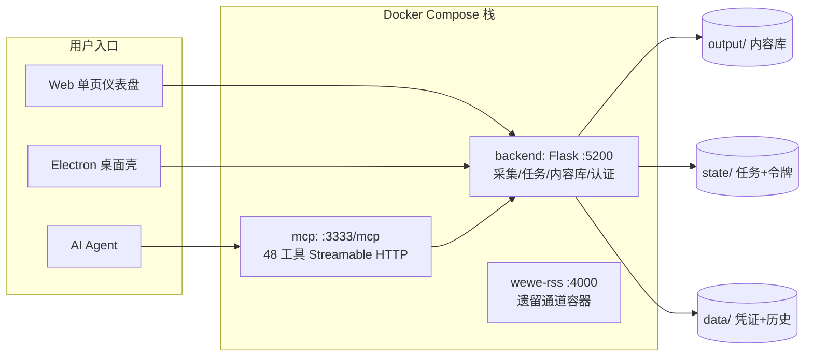

# 架构文档

> 反映当前实现状态（2026-09）。历史设计决策与演进过程见 [设计文档.md](设计文档.md)。

## 1. 运行时拓扑

本项目有两种**等价运行时形态**，共享同一套架构契约（端口、令牌、产物、任务模型）：

| 形态 | 进程监督者 | 适用场景 | 局限 |
|---|---|---|---|
| **Docker（主形态）** | docker-compose，Electron 薄壳仅托管 compose 生命周期 | 生产/日常使用，无本地 Python 依赖 | Playwright 窗口类平台认证受限（快手/小红书） |
| **Native（次要形态）** | Electron `service-manager` 直接监督 Python 进程 | 开发调试、需要窗口扫码的平台 | 依赖本地 Python 3.12 + venv |

**统一约定：**

- 两种形态共享相同卷语义：`data/`（凭证与历史）、`state/`（运行状态与令牌）、`output/`（内容库产物）
- 端口固定：backend `127.0.0.1:5200`、MCP `127.0.0.1:3333`、wewe-rss `127.0.0.1:4000`，全部仅绑定回环地址
- 令牌：后端启动时确保 `state/service.json`（含本地 bearer token），Electron/MCP/容器间调用统一凭它鉴权



## 2. 模块职责（backend/）

| 模块 | 职责 |
|---|---|
| `app.py` | Flask 装配：CORS 白名单、Host 守卫、蓝图注册、任务恢复 |
| `core/` | **契约层**：`state_store`（原子 JSON/JSONL）、`task_manager`（状态机+幂等）、`urlnorm`（URL 规范化与去重身份）、`errors`（错误码）、`html2md`、`log_redact` |
| `collectors/mp.py` | 公众号统一采集器：抓页 → 风控页守卫 → 正文抽取 → 媒体本地化 → 原子提交 |
| `mp_admin_login.py` | 公众号管理员通道：Playwright 扫码出图、cookie/token 维护、`mp_admin_get` 官方接口封装、频控熔断 |
| `mp_hot.py` | 爆款洞察发现源（第三方快照库，免登录） |
| `auth_requests.py` | 统一认证请求服务：平台适配器注册表、二维码生命周期、刷新预算 |
| `articles.py` | 文章列表（mp_admin appmsg）与历史归档（含风控熔断） |
| `accounts.py` | 公众号搜索/收藏（短链解析 + searchbiz 双轨） |
| `rss_scheduler.py` | 订阅增量采集调度（依赖 appmsg，见 ROADMAP 风险） |
| `library.py` / `library_api.py` | 内容库：原子发布协议、条目检索、打包导出、沙箱预览（CSP + 图片本地重写） |
| `security.py` | `local_access_required`：GET/HEAD 仅 Host 校验；POST 需令牌或同源 Origin |
| `collect_api.py` | 统一采集入口：URL 识别、任务 CRUD |
| `mcp_server/` | MCP 实现：`app.py`（Streamable HTTP + JSON-RPC）、`tools.py`（注册表+能力矩阵）、`platform_tools.py`（平台工具）、`resources.py` |

## 3. 关键数据流

### 3.1 公众号采集（短链通路，当前最稳）

```
提交 URL（Web/MCP）→ detect-url 识别 → 任务(queued→running)
  → curl_cffi 抓公开文章页（显式 UTF-8）
  → 风控页守卫 _detect_blocked_page：
      先认文章标记(msg_title/js_content) → 再查错误页(环境异常/参数错误/被删除) → 兜底空壳页
      命中 → 该条目 failed（附短链重采指引），绝不入库
  → 正文抽取(html→md) + mmbiz 图片本地化(含 source_url 映射)
  → 原子提交：.tmp 目录 → _COMPLETE 标记 → os.replace
  → metadata.json(schema_version/sha256 manifest/source_url) + 下载历史
```

### 3.2 认证（askuser 模式）

```
mp_start_auth → Playwright 打开 mp.weixin.qq.com → 截屏登录二维码(data URL)
  → agent 把二维码交给用户 → 用户扫码
  → mp_check_auth 轮询：检测 URL 重定向中的 token= → 导出 cookies → 校验 searchbiz
  → 凭证落 data/mp_admin_config.json（改造项：DPAPI 加密）
```

### 3.3 任务模型

- 状态机：`queued → running → succeeded / partially_succeeded / failed / cancelled`（协作式取消）；重启时 `recover()` 将 running 标记为 `interrupted`
- 幂等：`sha256(platform+kind+规范化参数)[:16]`，同键活跃任务直接复用；启动时从 `state/tasks/*.jsonl` 重建索引
- 持久化：JSONL 追加，每任务一文件

## 4. 产物契约（output/ v2）

```
output/mp/{author}/{date}_{title}_{entry_id}/
├── content.md / content.html
├── metadata.json     # schema_version 1.0、sha256 manifest、source_url 映射
├── media/            # img_{idx:03d}_{name}{ext}
└── _COMPLETE         # 原子发布标记：读取端只认含此标记的目录
```

条目身份 = `platform_item_id(url)`（per-platform 参数规则，见 `core/urlnorm.py`）；去重索引 `state/dedup_index.json` 以 `pid:` / `url:` 双键存储。

## 5. 安全模型

| 层 | 机制 |
|---|---|
| 网络绑定 | 所有端口仅 `127.0.0.1`（容器端口映射同样只发布到回环） |
| 请求鉴权 | GET/HEAD：Host 白名单；POST：本地令牌 或 同源 Origin；容器间：bearer token |
| CORS | 正则白名单，仅本机前端来源 |
| MCP 面 | 只读/采集类工具；破坏性操作（删历史/清缓存）与系统级变更（代理/证书）不暴露给 MCP |
| 日志脱敏 | 双层：桌面端 `logger.js` + 后端 `core/log_redact.py`（保留键名+前 4 字符） |
| 预览沙箱 | CSP `default-src 'none'` + 白名单、脚本剥离、本地图片重写 |

## 6. 测试

- `tests/test_core_contracts.py`（29 项）：持久化、任务状态机、幂等、URL 去重、风控守卫、爆款洞察
- `tests/test_stdio_and_redact.py`（8 项）：stdio 协议往返、48 工具数断言、日志脱敏
- 运行：`python -m pytest tests/ -q`（3 项 skill-inventory 用例需要 git 仓库环境，属环境性跳过）
