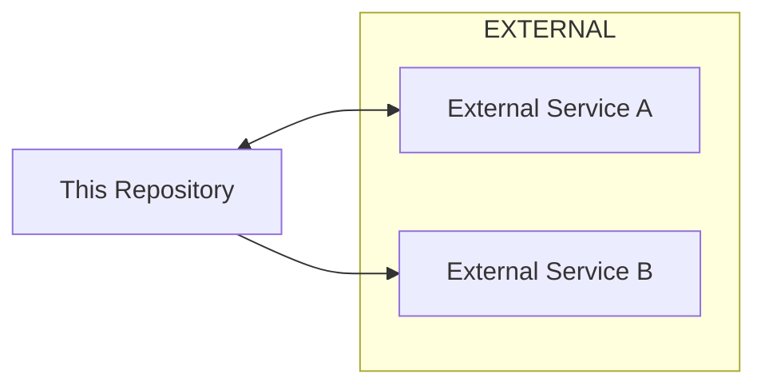
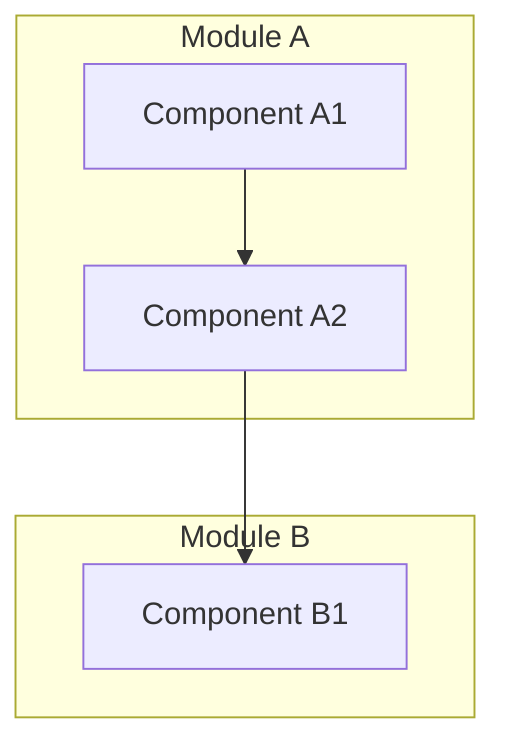
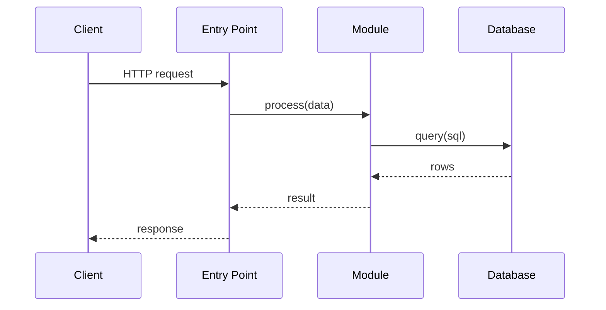

# Diagram Patterns — Mermaid Templates

## Purpose

Standard Mermaid diagram templates for Phase 4. All diagrams must
render in GitHub-flavored Markdown preview.

## General Rules

1. Use only `flowchart`, `sequenceDiagram`, and `graph` types.
2. Node IDs: use `UPPER_SNAKE_CASE`. Node labels: use "Title Case".
3. Subgraphs for logical grouping; match module names from Phase 3.
4. Add a brief caption below each diagram.

## System-Context Diagram

Caption: System context showing external dependencies.

## Component Diagram

Caption: Internal component relationships.

## Sequence Diagram

Caption: Typical request flow.

## Validation

- No raw HTML in diagrams.
- No `classDef` unless required for clarity.
- Every node must have a label.
- Test by pasting into GitHub Markdown preview.
